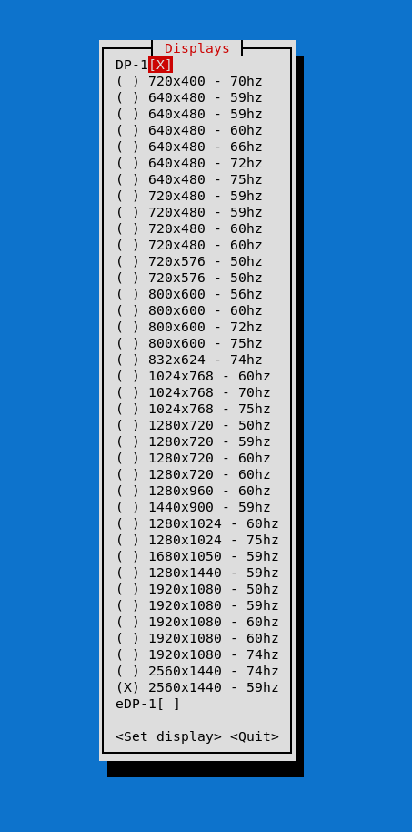

# swaydisplays

Very simple TUI for changing a screen resolution on Sway. It now only executes `swaymsg output` and sets the appropiate resolution
(not the refresh rate at the moment). Made this because changing resolutions with swaymsg each time is a bit cumbersome.

Just run `cargo run` to run it. It relies on `cursive` for the TUI.

## TODO

- The list of display modes should be a scrollview, otherwise content gets lost when the screen is too small

## Screenshot

